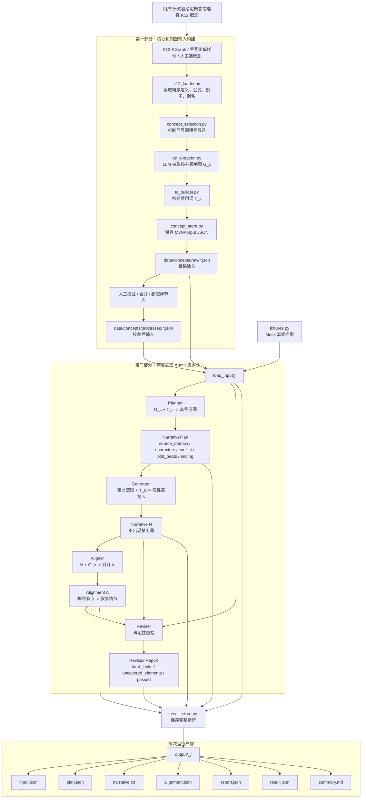

# 当前系统流程图

> 最近更新：2026-06-28。本文档描述当前代码实际跑通的 M2NA 原型流程。

## 总览



## 当前决策

### 输入不是关键词附近知识子图

输入给生成模型的是 **核心机制图** `G_c`，不是从关键词向外扩展得到的一大圈相关知识。

```text
关键词附近知识子图 = 这个概念周围有什么相关知识
核心机制图 G_c   = 这个概念内部如何一步步运作
```

当前 `gc_extractor.py` 的约束：

- 节点数优先控制在 `3-6` 个；
- 复杂机制最多 `8` 个节点；
- 边只保留主因果链和必要分叉；
- 禁止把背景知识、上下位概念、并列知识点塞进图里；
- 抽取结果先进入 `data/concepts/raw/`，仍需人工校验。

### 生成不是普通案例说明

第二部分已经从普通 `Planner -> Generator` 改为更强的寓言结构：

```text
Planner 生成寓言蓝图：
source_domain
characters
setting
conflict
plot_beats
turning_point
ending
implied_moral
mappings

Generator 再把蓝图写成隐性寓言 N
```

这样做的目的：让故事有角色、冲突、转折和后果，而不是只生成一个解释性小案例。

## 真实运行状态

已经用 DeepSeek 跑通过 3 个简单对话机制样例，并保存到 `output/`：

| 概念 | 输入 | 输出目录 | 自检 |
|---|---|---|---|
| 误会升级 | `data/concepts/raw/simple_dialogue_misunderstanding.json` | `output/20260628_142504_误会升级/` | PASS |
| 主动倾听 | `data/concepts/raw/simple_dialogue_active_listening.json` | `output/20260628_142545_主动倾听/` | PASS |
| 轮流发言 | `data/concepts/raw/simple_dialogue_turn_taking.json` | `output/20260628_142634_轮流发言/` | PASS |

运行命令：

```bash
uv run python run_real_demo.py data/concepts/raw/simple_dialogue_misunderstanding.json
uv run python run_real_demo.py data/concepts/raw/simple_dialogue_active_listening.json
uv run python run_real_demo.py data/concepts/raw/simple_dialogue_turn_taking.json
```

## 环境与密钥

- Python 环境由 `uv` 管理：`uv sync --dev`
- DeepSeek key 放在项目根目录 `.env`：

```bash
DEEPSEEK_API_KEY=...
```

- `.env` 被 `.gitignore` 忽略；模板见 `.env.example`。
- 如遇本机 TLS 拦截代理，使用：

```bash
security find-certificate -a -p /Library/Keychains/System.keychain > /tmp/corp_ca.pem
security find-certificate -a -p /System/Library/Keychains/SystemRootCertificates.keychain >> /tmp/corp_ca.pem
```

并在 `.env` 中设置：

```bash
SSL_CERT_FILE=/tmp/corp_ca.pem
DEEPSEEK_CA_BUNDLE=/tmp/corp_ca.pem
```
