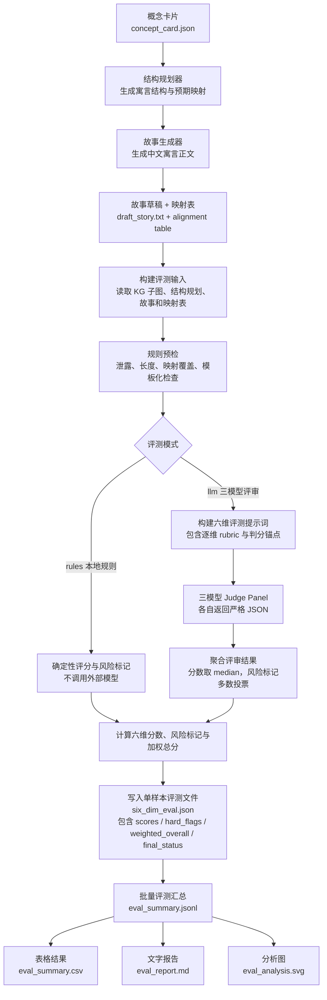
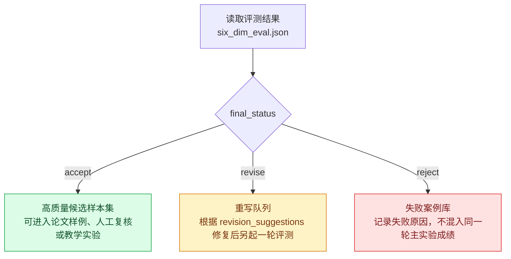

# 机器评测流程

本文档定义 AAAI-Fable / Concept-to-Fable 的本地机器评测流程。目标是让每个生成故事都能被稳定地转换为六维评分、硬性风险标记、可重写建议、CSV 报告、Markdown 报告和分析图。

## 实验目标与当前边界

本项目当前实验对象是 `kg_rag` 里的 **Graph-grounded Concept-to-Fable Generation**：输入 K12-KGraph 中的 Concept 节点和邻域上下文，输出一篇不直接点破术语的中文教学寓言，并保留概念到故事的结构映射表。

对应第六部分“知识先验寓言生成六维评测方案”，当前实现先落地三层评测架构中的第一层和第二层接口：

- 已实现：本地规则预筛、六维机器评分、硬性风险标记、批量报告、SVG 图表、重写队列入口。
- 已实现接口但默认不调用：多模型 LLM-as-Judge panel，可通过 `.env` 配置 OpenAI-compatible / Anthropic / Gemini judge。
- 先预留：人工前后测、人工多标注者一致性、外部 baseline 模型对比；这些不混入当前 20 条机器评测结论。

当前机器实验要回答的问题是：

| RQ | 问题 | 当前证据 |
|---|---|---|
| RQ1 | 生成样本是否满足六维评测输入格式，能否稳定批量打分 | `run-concept-fable-batch` + `evaluate-batch` |
| RQ2 | 知识先验和 alignment table 是否支持映射清晰度检查 | `structure_plan.json` + `draft_story.txt` 中 fenced JSON alignment table |
| RQ3 | 术语隐藏是否能被自动发现硬泄露 | `hard_leakage` / `title_leakage` / `soft_leakage` |
| RQ4 | 批量结果是否能转成可审阅报告和图 | `eval_summary.csv` / `eval_report.md` / `eval_analysis.svg` |

## 评测输入

每个样本必须对应一个目录：

```text
concept_dir/
├── concept_card.json
├── subgraph_pack.json
├── structure_plan.json
├── story_prompt.txt
├── draft_story.txt
└── six_dim_eval.json
```

机器评测读取三个核心文件：

- `subgraph_pack.json`：目标概念、定义、别名、课程知识图谱上下文。
- `structure_plan.json`：故事结构规划和概念到故事的预期映射。
- `draft_story.txt`：故事正文和 JSON fenced alignment table。

没有 `draft_story.txt` 或没有可解析 `alignment_table` 的样本不能进入正式评测，只能作为失败样本记录。

## 六个评测维度

| 维度 | 中文名 | 评测问题 | 权重 |
|---|---|---|---:|
| `faithfulness` | 忠实度 | 故事是否保留目标概念的关键机制和因果关系 | 0.25 |
| `implicitness` | 隐含性 | 故事正文和标题是否避免直接暴露概念名、别名或强术语 | 0.15 |
| `mapping_clarity` | 映射清晰度 | 概念实体、关系、过程是否能映射到角色、冲突、行动和结局 | 0.20 |
| `readability` | 可读性 | 中文是否自然、连贯、长度合适，是否适合目标学习者 | 0.10 |
| `pedagogical_value` | 教学价值 | 故事是否有助于理解、记忆或迁移目标概念 | 0.20 |
| `novelty` | 新颖性 | 是否避免常见寓言模板和同批次高度相似情节 | 0.10 |

加权总分：

```text
weighted_overall =
  0.25 * faithfulness
+ 0.20 * mapping_clarity
+ 0.20 * pedagogical_value
+ 0.15 * implicitness
+ 0.10 * readability
+ 0.10 * novelty
```

## 硬性风险标记

| flag | 含义 | 处理 |
|---|---|---|
| `hard_leakage` | 正文出现目标概念名、别名或禁用词 | 严格模式下直接 `reject` |
| `soft_leakage` | 出现“概念、机制、定义、术语”等解释性词 | 降低隐含性，通常 `revise` |
| `title_leakage` | 标题出现目标概念名或禁用词 | 严格模式下直接 `reject` |
| `concept_contradiction` | 故事传达的关系和概念定义冲突 | 直接 `reject` |
| `unmapped_core_mechanism` | alignment table 无法覆盖核心机制 | 直接 `reject` |
| `template_like` | 常见模板或同批次相似度过高 | 降低新颖性 |

## 状态裁决

```text
reject:
  faithfulness <= 2
  or mapping_clarity <= 2
  or concept_contradiction = true
  or unmapped_core_mechanism = true
  or hard_leakage = true

accept:
  faithfulness >= 4
  mapping_clarity >= 4
  pedagogical_value >= 4
  implicitness >= 4
  readability >= 3
  novelty >= 3
  and no blocking hard flags

otherwise:
  revise
```

## 流程图

图 1 只描述机器评测本身：从故事样本进入评测，到产出分数、风险标记、报告和分析图。`final_status` 只是 `six_dim_eval.json` 中的一个字段，不在主流程图中展开。



图 2 描述评测结果的下游处理。它不是评测本身，而是读取 `six_dim_eval.json` 之后的样本管理策略。



## AI Judge 提示词

本地 `rules` 模式不调用外部模型。`llm` 模式默认读取 `.env` 中的三组 `EVAL_JUDGE_1/2/3_*` 配置，形成三模型 judge panel。

三模型聚合规则：

- 每个 judge 使用同一份 `six_dim_eval_prompt.txt`。
- 每个维度取三个 judge 分数的 median。
- `hard_flags` 使用 `规则预检 OR 三模型多数投票`。
- 每个 judge 的原始响应保存为 `six_dim_eval_response_{index}_{judge}.txt`。
- 每个 judge 的结构化 JSON 保存为 `six_dim_eval_judge_{index}_{judge}.json`。
- 最终聚合结果写入 `six_dim_eval.json`。

`.env` 接口：

```text
EVAL_JUDGE_COUNT=3

EVAL_JUDGE_1_NAME=openai_judge
EVAL_JUDGE_1_PROVIDER=openai-compatible
EVAL_JUDGE_1_BASE_URL=https://api.openai.com/v1
EVAL_JUDGE_1_API_KEY=replace-me
EVAL_JUDGE_1_MODEL=replace-me-openai-model
EVAL_JUDGE_1_TEMPERATURE=0
EVAL_JUDGE_1_MAX_TOKENS=1600

EVAL_JUDGE_2_NAME=claude_judge
EVAL_JUDGE_2_PROVIDER=anthropic
EVAL_JUDGE_2_BASE_URL=https://api.anthropic.com/v1
EVAL_JUDGE_2_API_KEY=replace-me
EVAL_JUDGE_2_MODEL=replace-me-claude-model
EVAL_JUDGE_2_TEMPERATURE=0
EVAL_JUDGE_2_MAX_TOKENS=1600

EVAL_JUDGE_3_NAME=gemini_judge
EVAL_JUDGE_3_PROVIDER=gemini
EVAL_JUDGE_3_BASE_URL=https://generativelanguage.googleapis.com/v1beta
EVAL_JUDGE_3_API_KEY=replace-me
EVAL_JUDGE_3_MODEL=replace-me-gemini-model
EVAL_JUDGE_3_TEMPERATURE=0
EVAL_JUDGE_3_MAX_TOKENS=1600
```

`PROVIDER` 支持：

- `openai-compatible`：OpenAI / DeepSeek / Qwen / 任何兼容 `/chat/completions` 的服务。
- `anthropic`：Anthropic Messages API。
- `gemini`：Google Gemini `generateContent` API。

每个 judge 使用以下结构化提示词，要求返回严格 JSON。

System prompt:

```text
You are a strict evaluator of concept-grounded educational fables.
Evaluate whether the generated fable teaches the target concept faithfully, implicitly, and pedagogically.

General judging principles:
- Judge the story body, structure plan, graph context, and alignment table together.
- Do not reward fluent writing if the target concept mechanism is wrong, incomplete, or unmapped.
- Do not reward a story that directly reveals the target concept name, aliases, or forbidden terms.
- A high score in readability or novelty must never compensate for low faithfulness or low mapping clarity.
- Prefer conservative scores when evidence is missing from the story or alignment table.
- Return valid JSON only. Do not include markdown, prose outside JSON, or code fences.
```

User prompt schema:

```json
{
  "task": "Evaluate one concept-grounded fable on six dimensions. Return strict JSON only.",
  "target_concept": "...",
  "concept_id": "...",
  "concept_definition": "...",
  "forbidden_terms_for_story_body": ["..."],
  "subgraph_pack_summary": {
    "seed": {},
    "sections": {},
    "meta": {}
  },
  "structure_plan": {},
  "alignment_table": [],
  "story_body_to_evaluate_for_leakage": "...",
  "rule_findings": {},
  "dimensions": {
    "faithfulness": "忠实度",
    "implicitness": "隐含性",
    "mapping_clarity": "映射清晰度",
    "readability": "可读性",
    "pedagogical_value": "教学价值",
    "novelty": "新颖性"
  },
  "dimension_rubrics": {
    "faithfulness": {
      "core_question": "故事是否准确保留目标概念的核心机制、必要条件、因果关系和学科约束。",
      "score_5": "核心机制完整、因果链正确、没有概念误导；故事中的关键事件能支持概念定义和 KG 上下文。",
      "score_4": "核心机制基本正确，仅有轻微遗漏或表述不够精确，但不会误导学习者。",
      "score_3": "故事与概念相关，但只覆盖部分机制；存在明显简化，教学时需要补充解释。",
      "score_2": "机制覆盖很弱，重要条件或因果关系缺失；读者可能学到片面的理解。",
      "score_1": "故事传达的机制与目标概念冲突，或几乎没有表达目标概念。",
      "hard_downgrade_rules": [
        "If the story contradicts the concept definition, set concept_contradiction=true and faithfulness<=2.",
        "If the main concept mechanism cannot be recovered from story events, set unmapped_core_mechanism=true and faithfulness<=3.",
        "If the story only gives a moral lesson without the target mechanism, faithfulness<=2."
      ]
    },
    "implicitness": {
      "core_question": "故事正文和标题是否避免直接暴露目标概念名、别名、禁用词或过强术语线索。",
      "score_5": "正文和标题不出现目标概念名、别名、禁用词或明显术语；概念只通过情节结构隐含表达。",
      "score_4": "没有硬泄露，但存在少量较弱的学科线索；仍需要通过故事推理才能猜到概念。",
      "score_3": "没有直接写出概念名，但出现'概念/机制/定义/术语'等解释性词，隐含性一般。",
      "score_2": "出现接近目标概念的强提示、别名变体或过于直白的解释，学习者几乎无需推理。",
      "score_1": "正文或标题直接出现目标概念名、别名、禁用词，或直接说明'这个故事解释的是 X'。",
      "hard_downgrade_rules": [
        "If hard_leakage or title_leakage is true, implicitness=1.",
        "If soft_leakage is true but no hard leakage appears, implicitness<=3.",
        "Do not penalize target terms that appear only inside the JSON alignment metadata, unless they appear in the story body or title."
      ]
    },
    "mapping_clarity": {
      "core_question": "目标概念中的实体、条件、关系、过程和结果是否能稳定映射到故事角色、物件、冲突、行动和结局。",
      "score_5": "alignment_table 明确覆盖目标概念、核心机制、前置条件、相关概念、结果/应用和验证环节；故事证据具体可定位。",
      "score_4": "映射覆盖核心机制和主要因果链，但部分辅助角色或验证环节略简略。",
      "score_3": "能看出大致类比关系，但映射表或故事证据较泛；部分重要关系需要读者自行补齐。",
      "score_2": "只有零散角色或表层相似，核心机制和故事事件之间缺少稳定对应。",
      "score_1": "没有有效 alignment table，或故事与概念结构无法建立对应。",
      "hard_downgrade_rules": [
        "If alignment_table is empty or only contains vague generic evidence, mapping_clarity<=2.",
        "If target concept and core mechanism roles are both missing, set unmapped_core_mechanism=true.",
        "If the mapping relies on post-hoc explanation not present in the story, mapping_clarity<=3."
      ]
    },
    "readability": {
      "core_question": "故事是否是自然、连贯、适合目标年级的中文短寓言。",
      "score_5": "中文自然流畅，叙事有起承转合，长度适中，目标年级学习者无需额外解释即可读懂故事情节。",
      "score_4": "整体通顺，少量句子生硬或信息密度略高，但不影响阅读。",
      "score_3": "基本可读，但情节跳跃、重复、过短或过长；需要教师辅助理解。",
      "score_2": "语言明显机械，故事结构不完整，或大量堆砌抽象说明。",
      "score_1": "文本不连贯、难以读懂、不是故事，或语言不符合要求。",
      "hard_downgrade_rules": [
        "If the story is mostly exposition rather than narrative, readability<=3.",
        "If the story is too short to form a complete conflict-resolution arc, readability<=2.",
        "Do not give readability>3 when the text is fluent but not age-appropriate."
      ]
    },
    "pedagogical_value": {
      "core_question": "故事是否能帮助学习者理解、记忆、解释或迁移目标概念。",
      "score_5": "故事能自然引导学习者形成正确机制理解，并支持事后回映射、课堂提问或迁移应用。",
      "score_4": "有明确教学帮助，能辅助理解核心机制，但迁移或诊断误区的能力略弱。",
      "score_3": "有启发性，但主要停留在记忆或兴趣层面；概念理解仍需教师补充。",
      "score_2": "教学作用弱，故事好看但不能稳定帮助理解目标概念。",
      "score_1": "可能造成误解，或完全没有教育价值。",
      "hard_downgrade_rules": [
        "If faithfulness<=2, pedagogical_value<=2.",
        "If mapping_clarity<=2, pedagogical_value<=2.",
        "If the story cannot support a follow-up question about the target mechanism, pedagogical_value<=3."
      ]
    },
    "novelty": {
      "core_question": "故事是否避免常见寓言模板、同质化场景、套话结尾和同批次高度相似情节。",
      "score_5": "场景、角色、冲突和解决方式具体且少见；没有明显模板句式，同批故事中区分度高。",
      "score_4": "有一定新意，虽包含常见叙事结构，但关键设定和冲突较具体。",
      "score_3": "可接受但普通；存在常见寓言套路或较泛化的场景。",
      "score_2": "明显模板化，使用常见套话、相似角色或同批故事高度相似。",
      "score_1": "几乎是通用模板替换概念，缺乏任何具体创意。",
      "hard_downgrade_rules": [
        "If template_like is true, novelty<=2.",
        "If template_similarity>=0.82, novelty<=2.",
        "If the story uses generic wise elder/village/everyone understood style closure, novelty<=3."
      ]
    }
  },
  "weights": {
    "faithfulness": 0.25,
    "mapping_clarity": 0.20,
    "pedagogical_value": 0.20,
    "implicitness": 0.15,
    "readability": 0.10,
    "novelty": 0.10
  },
  "required_output_schema": {
    "scores": {
      "faithfulness": "integer 1-5",
      "implicitness": "integer 1-5",
      "mapping_clarity": "integer 1-5",
      "readability": "integer 1-5",
      "pedagogical_value": "integer 1-5",
      "novelty": "integer 1-5"
    },
    "hard_flags": {
      "hard_leakage": "boolean",
      "soft_leakage": "boolean",
      "title_leakage": "boolean",
      "concept_contradiction": "boolean",
      "unmapped_core_mechanism": "boolean",
      "template_like": "boolean"
    },
    "rationales": {
      "faithfulness": "1-3 sentences",
      "implicitness": "1-3 sentences",
      "mapping_clarity": "1-3 sentences",
      "readability": "1-3 sentences",
      "pedagogical_value": "1-3 sentences",
      "novelty": "1-3 sentences"
    },
    "revision_suggestions": ["short actionable suggestions"]
  }
}
```

## 本地执行命令

先构建 K12 graph、选择 concept、构建并 enrich concept cards：

```bash
python3 -m kg_rag normalize-k12
python3 -m kg_rag select-concept-nodes --limit-per-subject 5
python3 -m kg_rag build-concept-cards \
  --selection-path data/derived/kg_rag/concept_selection/k12_concepts.jsonl
python3 -m kg_rag enrich-concept-cards \
  --input data/derived/kg_rag/concept_cards/k12_concept_cards.raw.jsonl \
  --output data/derived/kg_rag/concept_cards/k12_concept_cards.enriched.jsonl \
  --mode rules
```

生成 20 个本地故事并评测：

```bash
python3 -m kg_rag run-concept-fable-batch \
  --concept-cards data/derived/kg_rag/concept_cards/k12_concept_cards.enriched.jsonl \
  --output-dir data/derived/kg_rag/concept_runs/local_20_machine_eval \
  --mode local \
  --language zh-CN \
  --limit 20 \
  --evaluate-mode rules \
  --no-resume

python3 -m kg_rag evaluate-batch \
  data/derived/kg_rag/concept_runs/local_20_machine_eval \
  --mode rules \
  --no-resume
```

关键输出：

```text
data/derived/kg_rag/concept_runs/local_20_machine_eval/eval_summary.jsonl
data/derived/kg_rag/concept_runs/local_20_machine_eval/eval_summary.csv
data/derived/kg_rag/concept_runs/local_20_machine_eval/eval_report.md
data/derived/kg_rag/concept_runs/local_20_machine_eval/eval_analysis.svg
```

## 本次 20 条机器评测结果

已用当前代码重新跑通：

```bash
python3 -m kg_rag run-concept-fable-batch \
  --concept-cards data/derived/kg_rag/concept_cards/k12_concept_cards.enriched.jsonl \
  --output-dir data/derived/kg_rag/concept_runs/local_20_machine_eval \
  --mode local \
  --language zh-CN \
  --limit 20 \
  --evaluate-mode rules \
  --no-resume

python3 -m kg_rag evaluate-batch \
  data/derived/kg_rag/concept_runs/local_20_machine_eval \
  --mode rules \
  --no-resume
```

运行结果：

| 检查项 | 结果 |
|---|---:|
| 生成样本数 | 20 |
| 生成成功 | 20 |
| 生成失败 | 0 |
| 批量评测成功 | 20 |
| 批量评测失败 | 0 |
| 加权总分均值 | 4.03 |
| Accept | 8 |
| Revise | 12 |
| Reject | 0 |

图表输出：

```text
data/derived/kg_rag/concept_runs/local_20_machine_eval/eval_analysis.svg
```

当前 12 条 `revise` 主要由 `template_like=true` 触发，说明本地离线故事生成器为了稳定格式仍偏模板化；这不影响评测链路完整性，但会作为下一步生成器改进或 LLM 重写的重点。

## 完整度检查

对照“知识先验寓言生成六维评测方案”的第六部分，当前项目落地情况如下：

| 要求 | 当前状态 | 证据 |
|---|---|---|
| 六维指标 | 已实现 | `kg_rag/evaluation/rubric.py` |
| 自动预筛 | 已实现 | `kg_rag/evaluation/rules.py` |
| LLM-as-Judge | 已预留并实现接口 | `kg_rag/evaluation/pipeline.py`、`.env.example` |
| 多 judge 聚合 | 已实现 | 分数取 median，硬标记为规则 OR 多数投票 |
| 批量评测 | 已实现 | `python3 -m kg_rag evaluate-batch ...` |
| CSV / Markdown 报告 | 已实现 | `kg_rag/evaluation/report.py` |
| 图表 | 已实现 | `eval_analysis.svg` |
| 至少 20 条数据跑通 | 已完成 | `eval_summary.jsonl` 20 行 |
| 人工测试 | 先预留 | 后续加入读者前后测和专家标注 |
| 对比模型 | 先预留 | 后续加入 direct prompting / CoT planning / ours 对照 |

人工测试建议保留为下一阶段，不把它伪装成当前结果。推荐设计：

- 专家标注：评 `faithfulness`、`mapping_clarity`、`concept_scope_coverage`。
- 普通读者：评 `readability`、`implicitness`、`pedagogical_value`。
- 教学前后测：A 组只读寓言，B 组读寓言加概念名，C 组直接读概念解释。
- 一致性：优先报告 Krippendorff's alpha 或 ICC；若使用 kappa，应使用 weighted kappa。

对比模型建议预留为下一阶段：

- `Direct Prompting`：直接根据概念名和定义生成寓言。
- `CoT Planning`：先列机制步骤，再生成寓言。
- `Analogy-first`：先生成映射表，再写故事。
- `Ours`：K12 图谱上下文 + 结构规划 + 对齐表 + 六维评测闭环。
- `Ours w/o KG`、`Ours w/o Alignment`：消融实验。
