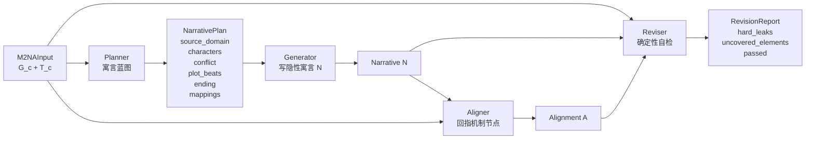

# M2NA 初版代码

任务：**Mechanism-to-Narrative Analogy Generation**

输入 `(G_c, T_c)` → 输出 `(N, A)`，并附流水线内自检。

- `G_c`：核心机制图，不是关键词附近知识子图。
- `T_c`：禁用词集合，包含概念名和高泄露术语。
- `N`：不点破目标概念的隐性寓言/叙事类比。
- `A`：机制节点到叙事情节的显式对齐。

完整系统流程图见 [`../doc/当前系统流程图.md`](../doc/当前系统流程图.md)。

## 当前流水线



## 关键设计

### Planner 不是只选源域

`m2na/agents/planner.py` 现在产出完整寓言蓝图：

```text
source_domain
setting
conflict
characters
mappings
plot_beats
turning_point
ending
implied_moral
```

这样 Generator 不需要临时发明故事骨架，能更稳定地产生有角色、冲突、转折和后果的寓言。

### Generator 不是普通案例生成

`m2na/agents/generator.py` 根据 `NarrativePlan` 写正文，并约束：

- 不出现 `T_c`；
- 不出现“这说明/这象征/这个概念/对应/机制”等解释性话语；
- 不写课堂、考试、模型训练或科普说明；
- 正文通过情节暗示机制，而不是显式解释机制。

### Reviser 是确定性自检

`m2na/agents/reviser.py` 不调 LLM，只检查：

- hard leakage：`N` 是否命中 `T_c`；
- mechanism coverage：`A` 是否覆盖 `G_c` 的全部节点。

这还不是完整第三部分评估模块，但已经能作为流水线内的质检环。

### LLM 是横切依赖

前三个 agent 使用同一个 `LLMClient` 协议：

```python
complete(prompt: str, system: str | None = None) -> str
```

因此可以切换：

- `MockLLMClient`：离线 demo / 单元测试；
- `DeepSeekClient`：真实模型；
- 其他 OpenAI-compatible / 本地模型后端。

`M2NAPipeline(..., aligner_llm=...)` 还支持给 Aligner 注入异源评判模型，减少“同一个模型生成又自评”的循环风险。

## 目录

| 路径 | 职责 |
|---|---|
| `m2na/types.py` | 不可变核心数据结构：`MechanismGraph` / `NarrativePlan` / `M2NAResult` 等 |
| `m2na/agents/llm.py` | 可插拔 LLM 协议 + 离线 `MockLLMClient` |
| `m2na/agents/deepseek.py` | DeepSeek OpenAI-compatible 后端，自动读取项目根 `.env` |
| `m2na/agents/planner.py` | `G_c + T_c` → 寓言蓝图 |
| `m2na/agents/generator.py` | 寓言蓝图 → 隐性寓言 `N` |
| `m2na/agents/aligner.py` | `N + G_c` → 对齐 `A` |
| `m2na/agents/reviser.py` | 确定性自检：硬泄露 + 机制覆盖 |
| `m2na/agents/pipeline.py` | 四 agent 编排 |
| `m2na/data/` | K12 概念加载、候选筛选、机制图抽取、禁用词构建、JSON 存取 |
| `m2na/result_store.py` | 保存一次运行的完整输入、中间产物和结果 |
| `m2na/fixtures.py` | Mock demo 输入：`path dependence` / `overfitting` |

## 运行

```bash
uv sync --dev
uv run python run_demo.py                 # Mock：跑全部 fixture
uv run python run_demo.py "overfitting"   # Mock：跑指定概念
uv run pytest                             # 测试
```

真实模型运行前，在项目根目录 `.env` 填写：

```bash
DEEPSEEK_API_KEY=...
```

然后运行：

```bash
uv run python run_real_demo.py data/concepts/raw/simple_dialogue_misunderstanding.json
uv run python run_real_demo.py data/concepts/raw/simple_dialogue_active_listening.json
uv run python run_real_demo.py data/concepts/raw/simple_dialogue_turn_taking.json
```

结果会保存到 `output/<timestamp>_<concept>/`，每个目录包含：

```text
input.json
plan.json
narrative.txt
alignment.json
report.json
result.json
summary.md
```

## 当前真实运行样例

2026-06-28 已用 DeepSeek 跑通 3 个简单对话机制样例：

| 概念 | 输出目录 | 自检 |
|---|---|---|
| 误会升级 | `output/20260628_142504_误会升级/` | PASS |
| 主动倾听 | `output/20260628_142545_主动倾听/` | PASS |
| 轮流发言 | `output/20260628_142634_轮流发言/` | PASS |

注意：PASS 只表示当前 hard leakage 与节点覆盖自检通过，不等于完整人工质量评估。
